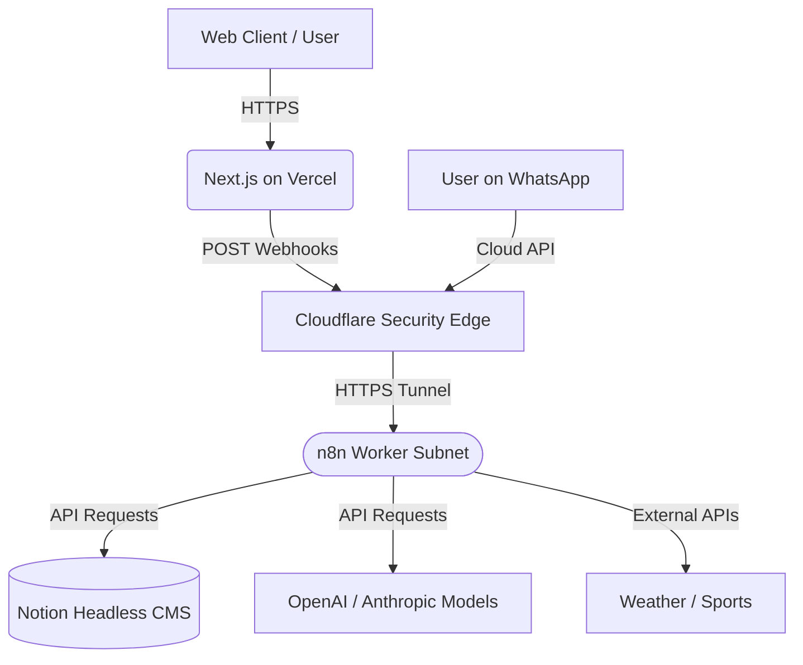

# Architectural Boundaries & Flow

This document defines the strict separation of the local Next.js frontend, headless n8n logic, and headless CMS execution.

## Core System Diagram

## Boundary Definitions

### 1. Front-End (Next.js)
The frontend is responsible solely for rendering UI, styling, static site generation, and capturing basic user intent (forms, clicks). It does **not** handle:
- Complex business logic or validation
- Analytics routing
- Direct database connections (No SQL/Prisma here)
- Any state management beyond simple React hooks

*Lead capture and user interactions are forwarded to the headless backend via webhooks.*

### 2. Back-End (n8n + Notion)
The backend is a purely detached, headless automation layer powered by n8n.
- **n8n**: Acts as the microservices router, execution engine, and API Gateway.
- **Notion**: Acts as the headless CMS and remote database. Data is pulled via Notion API during workflow execution, keeping the website perfectly static but dynamic via API.

## Subsite Architectures & Data Flows

### WhatsApp AI Hub (`/chaty`)
A multi-assistant WhatsApp gateway powered by the **MyWAtest** n8n workflow (ID: `Qx5heVRqQ0n2aAxU`).
- **Landing Page (`/chaty`)**: Dark-themed hub showcasing three hashtag-routed assistants on one WhatsApp number.
- **Assistants**:
  - **Aki-Chaty** (default) — CDMX place guide, curated KB via Notion.
  - **#Minerva** — Admin assistant for scheduling and inquiries.
  - **#Norte / CompaBot** — Pal Norte festival companion (meetups, VIP benefits, lost & found).
- **Architecture**: All routing, intent classification, and KB queries are handled server-side by n8n. The frontend is a pure landing page with WhatsApp deep links — no fetch calls.

> Previously this repo also hosted `/music` (Arlet piano-teaching landing),
> `/norte` (Pal Norte standalone), and `/daily` (private briefing). They have
> been removed: `/music` was extracted to the standalone `web-MusicArlet`
> repository; `/norte` and `/daily` were consolidated into `/chaty`.
